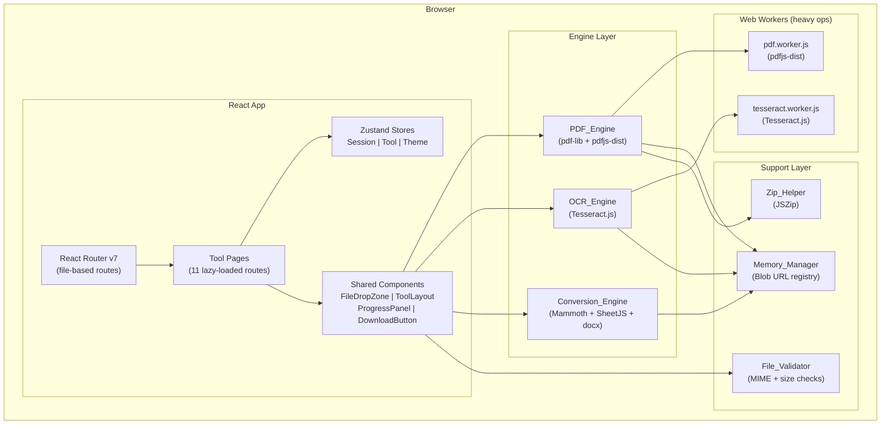

# Design Document — AuroraPDF

## Overview

AuroraPDF is a standalone, client-side PDF utility suite built with React 19.2.0, Vite, and TypeScript 5.x. Its defining principle is "Zero-Server, Total Privacy": every file operation runs entirely in the browser's memory using WebAssembly-backed libraries (pdf-lib, pdfjs-dist, Tesseract.js, SheetJS, Mammoth.js). No file data ever leaves the device.

The application exposes 11 tools covering PDF compression, OCR, image/document conversion, editing, signing, watermarking, and splitting. It is styled exclusively with `@stareezy-ui/components` and `@stareezy-ui/tokens`, supports light/dark themes, and meets WCAG 2.1 Level AA.

Key React 19 patterns used throughout:

- `useTransition` wraps all File_Processor invocations to keep the UI responsive.
- `useOptimistic` drives the progress bar so it never appears frozen.
- `<Suspense>` boundaries gate tool page asset loading with skeleton placeholders.
- React 19 `use()` hook reads async resources in render.

## Architecture

### High-Level Diagram



### Module Boundaries

| Layer             | Responsibility                                     | Key Libraries                                             |
| ----------------- | -------------------------------------------------- | --------------------------------------------------------- |
| Route / Page      | User interaction, form state, React 19 transitions | React Router v7                                           |
| Shared Components | Reusable UI (drop zone, progress, download)        | stareezy-ui                                               |
| Engine Layer      | File transformation logic                          | pdf-lib, pdfjs-dist, Tesseract.js, SheetJS, Mammoth, docx |
| Store Layer       | Global state (session, tool config, theme)         | Zustand 5.x                                               |
| Support Layer     | Memory management, validation, ZIP packaging       | JSZip, browser APIs                                       |

### Data Flow

```
User selects file
  → File_Validator validates MIME + size
  → Tool page dispatches React_Action via useTransition
    → Engine function runs (possibly in Web Worker)
      → Progress events → Session_Store.progress (via useOptimistic)
    → On success: Blob_URL registered with Memory_Manager
      → DownloadButton triggers browser download
        → Memory_Manager.revokeSession(sessionId) called within 3s
    → On error: Session_Store.status = 'error', Memory_Manager.revokeSession()
```

## Components and Interfaces

### Project Structure

```
aurora-pdf/
├── public/
│   └── favicon.svg
├── src/
│   ├── app/                          # Route-level page components
│   │   ├── HomePage.tsx              # Tool grid + privacy notice
│   │   ├── CompressPdfPage.tsx
│   │   ├── OcrPage.tsx
│   │   ├── PdfToJpgPage.tsx
│   │   ├── PdfToWordPage.tsx
│   │   ├── WordToPdfPage.tsx
│   │   ├── PdfToExcelPage.tsx
│   │   ├── ExcelToPdfPage.tsx
│   │   ├── EditPdfPage.tsx
│   │   ├── SignPdfPage.tsx
│   │   ├── WatermarkPage.tsx
│   │   └── SplitPdfPage.tsx
│   ├── components/                   # Shared UI (3-file convention)
│   │   ├── FileDropZone/
│   │   │   ├── FileDropZone.tsx
│   │   │   ├── FileDropZone.style.ts
│   │   │   └── FileDropZone.types.ts
│   │   ├── ToolLayout/
│   │   │   ├── ToolLayout.tsx
│   │   │   ├── ToolLayout.style.ts
│   │   │   └── ToolLayout.types.ts
│   │   ├── ProgressPanel/
│   │   │   ├── ProgressPanel.tsx
│   │   │   ├── ProgressPanel.style.ts
│   │   │   └── ProgressPanel.types.ts
│   │   ├── DownloadButton/
│   │   │   ├── DownloadButton.tsx
│   │   │   ├── DownloadButton.style.ts
│   │   │   └── DownloadButton.types.ts
│   │   ├── NavBar/
│   │   │   ├── NavBar.tsx
│   │   │   ├── NavBar.style.ts
│   │   │   └── NavBar.types.ts
│   │   ├── ThemeToggle/
│   │   │   ├── ThemeToggle.tsx
│   │   │   ├── ThemeToggle.style.ts
│   │   │   └── ThemeToggle.types.ts
│   │   └── Breadcrumb/
│   │       ├── Breadcrumb.tsx
│   │       ├── Breadcrumb.style.ts
│   │       └── Breadcrumb.types.ts
│   ├── engines/
│   │   ├── pdf-engine.ts             # PDF_Engine: compress, split, sign, watermark, edit, render
│   │   ├── ocr-engine.ts             # OCR_Engine: Tesseract.js wrapper
│   │   └── conversion-engine.ts      # Conversion_Engine: Word/Excel ↔ PDF
│   ├── stores/
│   │   ├── session.store.ts          # Session_Store
│   │   ├── tool.store.ts             # Tool_Store
│   │   └── theme.store.ts            # Theme_Store
│   ├── hooks/
│   │   ├── useFileProcessor.ts       # useTransition + useOptimistic wrapper
│   │   ├── useMemoryManager.ts       # Blob URL lifecycle hook
│   │   └── usePageTitle.ts           # Sets document.title per route
│   ├── lib/
│   │   ├── memory-manager.ts         # Blob URL registry (register, revokeSession, revokeAll)
│   │   ├── file-validator.ts         # MIME + extension + size validation
│   │   ├── zip-helper.ts             # JSZip wrapper
│   │   ├── filename-utils.ts         # Output filename generation helpers
│   │   └── format-utils.ts           # File size + percentage formatters
│   ├── types/
│   │   ├── session.types.ts
│   │   ├── tool.types.ts
│   │   └── engine.types.ts
│   ├── router.tsx                    # React Router v7 route config
│   └── main.tsx                      # App entry point
├── __tests__/
│   └── properties/                   # Property-based tests (Vitest + fast-check)
│       ├── memory-manager.property.test.ts
│       ├── file-validator.property.test.ts
│       ├── session-store.property.test.ts
│       ├── tool-store.property.test.ts
│       ├── theme-store.property.test.ts
│       ├── filename-utils.property.test.ts
│       ├── format-utils.property.test.ts
│       ├── ocr-engine.property.test.ts
│       ├── pdf-engine.property.test.ts
│       ├── conversion-engine.property.test.ts
│       └── split-engine.property.test.ts
├── vite.config.ts
├── tsconfig.json
└── package.json
```

### Routing

React Router v7 config-based routing in `src/router.tsx`:

| Path            | Component         | Title                               |
| --------------- | ----------------- | ----------------------------------- |
| `/`             | `HomePage`        | `AuroraPDF — Zero-Server PDF Tools` |
| `/compress`     | `CompressPdfPage` | `Compress PDF — AuroraPDF`          |
| `/ocr`          | `OcrPage`         | `OCR: Images to PDF — AuroraPDF`    |
| `/pdf-to-jpg`   | `PdfToJpgPage`    | `PDF to JPG — AuroraPDF`            |
| `/pdf-to-word`  | `PdfToWordPage`   | `PDF to Word — AuroraPDF`           |
| `/word-to-pdf`  | `WordToPdfPage`   | `Word to PDF — AuroraPDF`           |
| `/pdf-to-excel` | `PdfToExcelPage`  | `PDF to Excel — AuroraPDF`          |
| `/excel-to-pdf` | `ExcelToPdfPage`  | `Excel to PDF — AuroraPDF`          |
| `/edit`         | `EditPdfPage`     | `Edit PDF — AuroraPDF`              |
| `/sign`         | `SignPdfPage`     | `Sign PDF — AuroraPDF`              |
| `/watermark`    | `WatermarkPage`   | `Add Watermark — AuroraPDF`         |
| `/split`        | `SplitPdfPage`    | `Split PDF — AuroraPDF`             |

All tool pages are lazy-loaded via `React.lazy()` wrapped in `<Suspense>` with a `<Skeleton>` fallback.

### Shared Component Interfaces

```typescript
// FileDropZone
interface FileDropZoneProps {
  accept: AcceptedFileType[]; // MIME types + extensions for this tool
  multiple?: boolean; // default false
  maxSizeMb?: number; // default 100
  onFilesAccepted: (files: File[]) => void;
  onError: (message: string) => void;
  disabled?: boolean;
  "aria-label"?: string;
}

// ToolLayout
interface ToolLayoutProps {
  toolName: string; // used for breadcrumb + title
  children: React.ReactNode;
}

// ProgressPanel
interface ProgressPanelProps {
  status: SessionStatus; // 'idle' | 'processing' | 'complete' | 'error'
  progress: number; // 0–100
  label?: string; // e.g. "Processing image 2 of 5 — 40%"
  errorMessage?: string;
  onRetry?: () => void;
}

// DownloadButton
interface DownloadButtonProps {
  blobUrl: string | null;
  filename: string;
  onDownloadComplete: () => void; // triggers Memory_Manager.revokeSession
  disabled?: boolean;
}

// NavBar
interface NavBarProps {
  currentPath: string;
}

// ThemeToggle — no props (reads/writes Theme_Store directly)

// Breadcrumb
interface BreadcrumbProps {
  toolName: string; // renders "Home > {toolName}"
}
```

## Data Models

### Zustand Store Shapes

```typescript
// src/types/session.types.ts
export type SessionStatus = "idle" | "processing" | "complete" | "error";

export interface ProcessingSession {
  sessionId: string; // uuid v4, generated at session start
  status: SessionStatus;
  progress: number; // 0–100 inclusive
  progressLabel: string; // human-readable progress description
  errorMessage: string | null;
  outputFilename: string | null;
  outputBlobUrl: string | null;
}

// src/stores/session.store.ts
interface SessionStore extends ProcessingSession {
  startSession: () => void; // generates new sessionId, sets status='processing'
  updateProgress: (progress: number, label?: string) => void;
  completeSession: (blobUrl: string, filename: string) => void;
  failSession: (errorMessage: string) => void;
  resetSession: () => void;
}
```

```typescript
// src/types/tool.types.ts
export type CompressionLevel = "low" | "standard" | "high";
export type OcrLanguage = string; // Tesseract.js language code
export type WatermarkPlacement = "diagonal" | "header" | "footer";
export type SignatureMethod = "draw" | "type" | "upload";
export type DpiOption = 150 | 300;

export interface WatermarkConfig {
  text: string; // 1–100 chars
  fontSize: number; // 8–144
  opacity: number; // 10–100 (percent)
  color: string; // hex color string
  rotation: number; // 0–360 degrees
  placement: WatermarkPlacement;
}

export interface SignatureConfig {
  method: SignatureMethod;
  dataUrl: string | null; // canvas data URL or uploaded image data URL
  typedName: string | null;
  pageIndex: number; // 0-based
  x: number; // position on page (0–1 normalized)
  y: number;
  width: number; // size on page (0–1 normalized)
  height: number;
}

export interface EditAction {
  type: "add-text" | "delete-page" | "reorder-pages";
  payload: unknown;
  timestamp: number;
}

export interface ToolConfig {
  // Compress
  compressionLevel: CompressionLevel;
  // OCR
  ocrLanguage: OcrLanguage;
  // PDF to JPG
  dpi: DpiOption;
  // Watermark
  watermark: WatermarkConfig;
  // Sign
  signature: SignatureConfig;
  // Split
  pageRangeInput: string;
  namedRanges: Array<{ name: string; range: string }>;
  // Edit
  editHistory: EditAction[];
  editHistoryIndex: number; // pointer for undo
}

// src/stores/tool.store.ts
interface ToolStore {
  config: ToolConfig;
  setCompressionLevel: (level: CompressionLevel) => void;
  setOcrLanguage: (lang: OcrLanguage) => void;
  setDpi: (dpi: DpiOption) => void;
  setWatermark: (config: Partial<WatermarkConfig>) => void;
  setSignature: (config: Partial<SignatureConfig>) => void;
  setPageRangeInput: (input: string) => void;
  addNamedRange: (name: string, range: string) => void;
  removeNamedRange: (index: number) => void;
  pushEditAction: (action: EditAction) => void;
  undoEditAction: () => void;
  resetToDefaults: () => void; // called on route change
}
```

```typescript
// src/stores/theme.store.ts
export type Theme = "light" | "dark";

interface ThemeStore {
  theme: Theme;
  toggleTheme: () => void; // flips theme + persists to localStorage key 'aurora-pdf-theme'
}
```

### Memory Manager

```typescript
// src/lib/memory-manager.ts
export interface MemoryManager {
  register: (sessionId: string, url: string) => void;
  revokeSession: (sessionId: string) => void; // revokes all URLs for sessionId
  revokeAll: () => void; // revokes every tracked URL
  getSessionUrls: (sessionId: string) => string[]; // for testing
}

// Internal state: Map<sessionId, Set<blobUrl>>
```

### File Validator

```typescript
// src/lib/file-validator.ts
export interface AcceptedFileType {
  mime: string;
  extension: string; // e.g. '.pdf', '.docx'
}

export interface ValidationResult {
  valid: boolean;
  errorMessage: string | null;
}

export function validateFile(
  file: File,
  accepted: AcceptedFileType[],
  maxSizeMb?: number, // default 100
): ValidationResult;
```

### Engine Types

```typescript
// src/types/engine.types.ts
export interface ProgressCallback {
  (progress: number, label?: string): void;
}

export interface EngineResult<T = Uint8Array> {
  data: T;
  metadata?: Record<string, unknown>;
}

// PDF_Engine output for PDF-to-JPG
export interface PageImageResult {
  pageIndex: number;
  blob: Blob;
  filename: string;
}

// Conversion_Engine output for PDF-to-Excel
export interface TableSheet {
  label: string; // "Page {n} Table {m}"
  data: unknown[][];
}
```

## Engine Layer

### PDF_Engine (`src/engines/pdf-engine.ts`)

Wraps `pdf-lib` (creation/editing) and `pdfjs-dist` (rendering/parsing). Heavy rendering operations delegate to `pdf.worker.js` via the pdfjs-dist worker mechanism.

```typescript
export interface PDFEngine {
  // Compression
  compress(
    file: File,
    level: CompressionLevel,
    onProgress: ProgressCallback,
  ): Promise<Uint8Array>;

  // Rendering
  renderPageAsJpeg(
    pdfBytes: Uint8Array,
    pageIndex: number,
    dpi: DpiOption,
  ): Promise<Blob>;
  getPageCount(pdfBytes: Uint8Array): Promise<number>;
  renderThumbnail(pdfBytes: Uint8Array, pageIndex: number): Promise<string>; // data URL

  // Editing
  deletePages(pdfBytes: Uint8Array, pageIndices: number[]): Promise<Uint8Array>;
  reorderPages(pdfBytes: Uint8Array, newOrder: number[]): Promise<Uint8Array>;
  addTextAnnotation(
    pdfBytes: Uint8Array,
    annotation: TextAnnotation,
  ): Promise<Uint8Array>;

  // Signing
  embedSignature(
    pdfBytes: Uint8Array,
    config: SignatureConfig,
  ): Promise<Uint8Array>;

  // Watermark
  applyWatermark(
    pdfBytes: Uint8Array,
    config: WatermarkConfig,
    onProgress: ProgressCallback,
  ): Promise<Uint8Array>;

  // Split
  extractPages(
    pdfBytes: Uint8Array,
    pageIndices: number[],
  ): Promise<Uint8Array>;

  // OCR assembly
  assembleTextPdf(pages: OcrPageResult[]): Promise<Uint8Array>;

  // Utility
  isEncrypted(pdfBytes: Uint8Array): Promise<boolean>;
  hasTextLayer(pdfBytes: Uint8Array): Promise<boolean>;
}

export interface TextAnnotation {
  pageIndex: number;
  text: string;
  x: number; // points from left
  y: number; // points from bottom
  fontSize: number; // 8–144
  color: string; // hex
}

export interface OcrPageResult {
  text: string;
  imageIndex: number;
}
```

**Design decisions:**

- `pdf-lib` handles all write operations (compress, edit, sign, watermark, split, assemble). It operates on `Uint8Array` and runs synchronously in the main thread for small files, or can be offloaded.
- `pdfjs-dist` handles all read/render operations (page count, thumbnail rendering, text extraction). Its worker is configured via `GlobalWorkerOptions.workerSrc`.
- Compression is implemented by re-embedding images at lower JPEG quality using pdf-lib's image replacement API. Content streams are re-serialized to remove redundant operators.

### OCR_Engine (`src/engines/ocr-engine.ts`)

Wraps `tesseract.js`. Tesseract's own worker handles the heavy lifting.

```typescript
export interface OCREngine {
  recognize(
    image: File,
    language: OcrLanguage,
    onProgress: ProgressCallback,
  ): Promise<OcrPageResult>;

  recognizeAll(
    images: File[],
    language: OcrLanguage,
    onProgress: ProgressCallback, // called after each image: progress = (i+1)/n * 100
  ): Promise<OcrPageResult[]>;

  getSupportedLanguages(): OcrLanguageOption[];
}

export interface OcrLanguageOption {
  code: string; // e.g. 'eng'
  label: string; // e.g. 'English'
}
```

Supported languages (minimum 10): English, French, German, Spanish, Italian, Portuguese, Dutch, Russian, Chinese (Simplified), Japanese, Arabic, Korean.

### Conversion_Engine (`src/engines/conversion-engine.ts`)

```typescript
export interface ConversionEngine {
  // PDF → Word
  pdfToDocx(
    pdfBytes: Uint8Array,
    onProgress: ProgressCallback,
  ): Promise<Uint8Array>;

  // Word → PDF
  docxToPdf(file: File, onProgress: ProgressCallback): Promise<Uint8Array>;

  // PDF → Excel
  pdfToXlsx(
    pdfBytes: Uint8Array,
    onProgress: ProgressCallback,
  ): Promise<{ sheets: TableSheet[]; bytes: Uint8Array }>;

  // Excel → PDF
  xlsxToPdf(file: File, onProgress: ProgressCallback): Promise<Uint8Array>;
}
```

**Design decisions:**

- `pdfToDocx`: Uses `pdfjs-dist` to extract text content with structure hints (font size → heading level heuristic), then `docx` library to build the `.docx` output.
- `docxToPdf`: Uses `mammoth` to convert `.docx` → HTML, then a custom HTML-to-pdf-lib renderer that maps `<h1>`–`<h6>`, `<p>`, `<strong>`, `<em>`, `<u>` to pdf-lib drawing calls.
- `pdfToXlsx`: Uses `pdfjs-dist` text content API to detect table structures (heuristic: items aligned in rows/columns within a bounding box), then `SheetJS` to write the `.xlsx`.
- `xlsxToPdf`: Uses `SheetJS` to read the workbook, then renders each sheet as a grid using pdf-lib's table drawing primitives.

## Per-Tool Design

### Tool 1: Compress PDF (`/compress`)

**Accepted input:** `.pdf` (application/pdf), max 100 MB  
**Output:** `{original-name}_compressed.pdf`

**Processing flow:**

1. User drops/selects PDF → `File_Validator` checks MIME + size.
2. User selects compression level (Low / Standard / High) via `Tabs` component.
3. User clicks "Compress" → `useTransition` dispatches React_Action.
4. `PDF_Engine.compress()` re-samples embedded images at target JPEG quality (Low=85, Standard=65, High=40) and re-serializes content streams.
5. Progress emitted at 0%, 50% (image pass), 100% (stream pass).
6. If output ≥ input size: show "No reduction achieved" notice, offer original for download.
7. On success: display original size, compressed size, % reduction (2 decimal places). Show `DownloadButton`.

**Key UI elements:** `Tabs` (compression level), `Progress` bar, file info display, compression stats card.

---

### Tool 2: OCR — Images to Searchable PDF (`/ocr`)

**Accepted input:** JPEG, PNG, TIFF, BMP, WebP (multiple files), max 100 MB each  
**Output:** `ocr-output.pdf`

**Processing flow:**

1. User drops/selects one or more images → validated per file.
2. User selects OCR language from `Dropdown` (12 options).
3. User clicks "Run OCR" → `useTransition` dispatches React_Action.
4. `OCR_Engine.recognizeAll()` processes images sequentially; after each: `useOptimistic` updates progress label "Processing image {k} of {n} — {pct}%".
5. Images with no detected text: blank page inserted, filenames collected for warning.
6. `PDF_Engine.assembleTextPdf()` builds the searchable PDF preserving input order.
7. On success: show `DownloadButton`. If any blank pages: show warning list.

**Key UI elements:** `FileDropZone` (multiple), `Dropdown` (language), `Progress` bar with label, warning `Modal`.

---

### Tool 3: PDF to JPG (`/pdf-to-jpg`)

**Accepted input:** `.pdf`, max 100 MB  
**Output:** `{original-name}_pages.zip` (multi-page) or `{original-name}_page1.jpg` (single page)

**Processing flow:**

1. User drops PDF → validated.
2. User selects DPI: 150 or 300 via `Tabs`.
3. User clicks "Convert" → `useTransition` dispatches React_Action.
4. `PDF_Engine.getPageCount()` → iterate pages, `PDF_Engine.renderPageAsJpeg()` per page.
5. Progress: "Rendering page {k} of {n}".
6. Single page: direct JPEG download. Multi-page: `Zip_Helper` packages all JPEGs → ZIP download.

**Key UI elements:** `Tabs` (DPI), `Progress` bar with label.

---

### Tool 4: PDF to Word (`/pdf-to-word`)

**Accepted input:** `.pdf`, max 100 MB  
**Output:** `{original-name}.docx`

**Processing flow:**

1. User drops PDF → validated.
2. `PDF_Engine.isEncrypted()` → if true: show error, stop.
3. `PDF_Engine.hasTextLayer()` → if false: show "image-based PDF" notification suggesting OCR tool, stop.
4. User clicks "Convert" → `useTransition` dispatches React_Action.
5. `Conversion_Engine.pdfToDocx()` extracts text with structure, builds `.docx`.
6. On success: show `DownloadButton`.

**Key UI elements:** `Progress` bar, informational notices.

---

### Tool 5: Word to PDF (`/word-to-pdf`)

**Accepted input:** `.docx` only (application/vnd.openxmlformats-officedocument.wordprocessingml.document), max 100 MB  
**Output:** `{original-name}.pdf`

**Processing flow:**

1. User drops `.docx` → validated (`.doc` rejected with specific message).
2. User clicks "Convert" → `useTransition` dispatches React_Action.
3. `Conversion_Engine.docxToPdf()`: Mammoth parses → HTML → pdf-lib renders.
4. If Mammoth throws: show parse error, stop.
5. On success: show `DownloadButton`.

**Key UI elements:** `Progress` bar, error display.

---

### Tool 6: PDF to Excel (`/pdf-to-excel`)

**Accepted input:** `.pdf`, max 100 MB  
**Output:** `{original-name}.xlsx`

**Processing flow:**

1. User drops PDF → validated.
2. `PDF_Engine.isEncrypted()` → if true: show error, stop.
3. User clicks "Convert" → `useTransition` dispatches React_Action.
4. `Conversion_Engine.pdfToXlsx()` detects tables, assigns worksheet labels `Page {n} Table {m}`.
5. If no tables detected: show "no tables found" notice, stop.
6. On success: show `DownloadButton`.

**Key UI elements:** `Progress` bar, table detection result summary.

---

### Tool 7: Excel to PDF (`/excel-to-pdf`)

**Accepted input:** `.xlsx`, `.xls`, max 100 MB  
**Output:** `{original-name}.pdf`

**Processing flow:**

1. User drops spreadsheet → validated.
2. SheetJS reads workbook to get sheet count. If > 10 sheets: show warning banner.
3. User clicks "Convert" → `useTransition` dispatches React_Action.
4. `Conversion_Engine.xlsxToPdf()`: each worksheet → one PDF page.
5. If SheetJS throws: show parse error, stop.
6. On success: show `DownloadButton`.

**Key UI elements:** `Progress` bar, sheet count warning.

---

### Tool 8: Edit PDF (`/edit`)

**Accepted input:** `.pdf`, max 100 MB  
**Output:** `{original-name}_edited.pdf`

**Processing flow:**

1. User drops PDF → validated.
2. `useTransition` wraps thumbnail rendering: `PDF_Engine.renderThumbnail()` per page → scrollable grid.
3. Edit actions available: add text annotation, delete page(s), reorder pages (drag-and-drop).
4. Each action pushed to `Tool_Store.editHistory` (max 10; oldest dropped when full). Undo pops the stack.
5. User clicks "Export" → `useTransition` dispatches React_Action.
6. Actions replayed on `Uint8Array` via `PDF_Engine` methods in order.
7. On success: show `DownloadButton`.

**Key UI elements:** Thumbnail grid (drag-and-drop reorder), text annotation form (`Input`, `Slider` for font size, color picker), "Undo" `Button`, `Modal` for delete confirmation.

---

### Tool 9: Sign PDF (`/sign`)

**Accepted input:** `.pdf`, max 100 MB  
**Output:** `{original-name}_signed.pdf`

**Processing flow:**

1. User drops PDF → validated.
2. User selects target page via `Dropdown`.
3. `PDF_Engine.renderThumbnail()` renders selected page as preview.
4. User chooses signature method via `Tabs` (Draw / Type / Upload).
   - Draw: HTML5 `<canvas>` with mouse/touch event listeners → `toDataURL('image/png')`.
   - Type: `Input` field → rendered in cursive font → `<canvas>` → `toDataURL`.
   - Upload: `FileDropZone` (PNG/JPEG only, max 5 MB) → `FileReader` → data URL.
5. User positions/resizes signature overlay on page preview.
6. User clicks "Apply Signature" → `useTransition` dispatches React_Action.
7. `PDF_Engine.embedSignature()` embeds the data URL as an image on the target page.
8. On success: show `DownloadButton`.

**Key UI elements:** `Tabs` (signature method), canvas drawing area, page preview with draggable overlay, `Dropdown` (page selector).

---

### Tool 10: Add Watermark (`/watermark`)

**Accepted input:** `.pdf`, max 100 MB  
**Output:** `{original-name}_watermarked.pdf`

**Processing flow:**

1. User drops PDF → validated.
2. Configuration panel: text `Input`, font size `Slider` (8–144), opacity `Slider` (10–100), color picker (`Input` type=color), rotation `Slider` (0–360), placement `Tabs` (Diagonal / Header / Footer).
3. Live preview: debounced 300ms → `PDF_Engine.renderThumbnail()` of page 1 with watermark overlay rendered via CSS transform on top of the preview image.
4. User clicks "Apply Watermark" → `useTransition` dispatches React_Action.
5. `PDF_Engine.applyWatermark()` iterates all pages, draws text with pdf-lib's `drawText` at computed position.
6. On success: show `DownloadButton`.

**Key UI elements:** `Input`, `Slider` (×3), color `Input`, `Tabs` (placement), live preview panel.

---

### Tool 11: Split PDF (`/split`)

**Accepted input:** `.pdf`, max 100 MB  
**Output:** `{original-name}_split.pdf` (single range) or `{original-name}_split_parts.zip` (multiple ranges)

**Processing flow:**

1. User drops PDF → validated.
2. `PDF_Engine.getPageCount()` → display total pages.
3. User specifies page range(s): text `Input` with format `1-3, 5, 7-9`, validated in real time.
4. Optional: user adds named ranges (multiple outputs).
5. User clicks "Split" → `useTransition` dispatches React_Action.
6. For each range: `PDF_Engine.extractPages()` → `Uint8Array`.
7. Single range: direct PDF download. Multiple ranges: `Zip_Helper` packages all PDFs → ZIP download.
8. On success: show `DownloadButton`.

**Key UI elements:** Page count display, range `Input` with inline validation, named ranges list, thumbnail grid for visual page selection.

## React 19 Patterns

### `useTransition` — Non-blocking Processing

Every tool page wraps its File_Processor invocation in `useTransition`. This keeps navigation, theme toggle, and error dismissal responsive while heavy engine work runs.

```typescript
// src/hooks/useFileProcessor.ts
export function useFileProcessor<TConfig>(
  processor: (
    file: File,
    config: TConfig,
    onProgress: ProgressCallback,
  ) => Promise<Uint8Array>,
) {
  const [isPending, startTransition] = useTransition();
  const { startSession, updateProgress, completeSession, failSession } =
    useSessionStore();

  const run = (file: File, config: TConfig, outputFilename: string) => {
    startTransition(async () => {
      startSession();
      try {
        const bytes = await processor(file, config, (p, label) =>
          updateProgress(p, label),
        );
        const blob = new Blob([bytes], { type: "application/octet-stream" });
        const url = URL.createObjectURL(blob);
        memoryManager.register(sessionId, url);
        completeSession(url, outputFilename);
      } catch (err) {
        failSession(err instanceof Error ? err.message : "Unknown error");
        memoryManager.revokeSession(sessionId);
      }
    });
  };

  return { run, isPending };
}
```

### `useOptimistic` — Frozen-free Progress Bar

```typescript
// Inside each tool page
const [optimisticProgress, setOptimisticProgress] = useOptimistic(
  session.progress,
  (_state, newProgress: number) => newProgress,
);

// Passed to ProgressPanel — always shows the latest optimistic value
<ProgressPanel progress={optimisticProgress} ... />
```

### `<Suspense>` — Skeleton Loading

```typescript
// src/router.tsx
const EditPdfPage = React.lazy(() => import('./app/EditPdfPage'));

<Suspense fallback={<ToolPageSkeleton />}>
  <EditPdfPage />
</Suspense>
```

`ToolPageSkeleton` uses `@stareezy-ui/components` `Skeleton` component to render placeholder shapes matching the tool's layout.

### `use()` Hook

Used in tool pages to read a promise-based resource (e.g., initial page count after file selection) without `useEffect`:

```typescript
// Inside a tool page component, after file is selected
const pageCount = use(getPdfPageCount(fileBytes));
```

## Correctness Properties

_A property is a characteristic or behavior that should hold true across all valid executions of a system — essentially, a formal statement about what the system should do. Properties serve as the bridge between human-readable specifications and machine-verifiable correctness guarantees._

---

### Property 1: Memory_Manager session cleanup

_For any_ set of sessions each containing any number of registered Blob URLs, calling `revokeSession(sessionId)` should result in zero tracked URLs remaining for that session, while all URLs belonging to other sessions remain unaffected.

**Validates: Requirements 1.2, 1.5**

---

### Property 2: Memory_Manager revokeAll empties registry

_For any_ state of the Memory_Manager registry (any number of sessions, any number of URLs per session), calling `revokeAll()` should result in the registry containing zero tracked URLs across all sessions.

**Validates: Requirements 1.3**

---

### Property 3: Session_Store progress invariant

_For any_ sequence of `updateProgress` calls with arbitrary numeric inputs, the stored `progress` value should always be clamped to the range [0, 100], and `status` should always be one of `'idle' | 'processing' | 'complete' | 'error'`.

**Validates: Requirements 2.2, 15.2, 15.3**

---

### Property 4: Tool_Store resets to defaults on navigation

_For any_ tool configuration state (any combination of compression level, OCR language, watermark settings, etc.), calling `resetToDefaults()` should produce a config object identical to the initial default config regardless of what mutations were applied before.

**Validates: Requirements 2.3**

---

### Property 5: Theme_Store toggle round-trip

_For any_ initial theme value, calling `toggleTheme()` twice should return the theme to its original value. Additionally, after a single `toggleTheme()` call, `localStorage.getItem('aurora-pdf-theme')` should equal the new theme string.

**Validates: Requirements 2.4, 17.3**

---

### Property 6: File validator accepts/rejects by MIME type and extension

_For any_ file with a given MIME type and extension, `validateFile()` should return `valid: true` if and only if the MIME type and extension both appear in the accepted list for the active tool. Files with a valid MIME but wrong extension, or valid extension but wrong MIME, should be rejected.

**Validates: Requirements 3.2, 3.3, 5.1, 8.5**

---

### Property 7: File size validation rejects files exceeding the limit

_For any_ file size in bytes and any maximum size limit in MB, `validateFile()` should return `valid: false` with a descriptive error message if and only if the file size exceeds the limit. Files at exactly the limit should be accepted.

**Validates: Requirements 3.4, 12.6**

---

### Property 8: File info formatter produces correct output

_For any_ file name string and file size in bytes, `formatFileInfo()` should return a string containing the original file name and the size expressed in KB (if < 1 MB) or MB (if ≥ 1 MB), with the numeric value rounded to two decimal places.

**Validates: Requirements 3.5**

---

### Property 9: Combined file size calculation

_For any_ non-empty array of files, the computed combined size should equal the sum of all individual file sizes, and the displayed count should equal the array length.

**Validates: Requirements 3.6**

---

### Property 10: Compression output is a valid parseable PDF

_For any_ valid PDF input bytes and any compression level, the output of `PDF_Engine.compress()` should be parseable by `pdfjs-dist` without error and should contain the same number of pages as the input.

**Validates: Requirements 4.1**

---

### Property 11: Compression stats formatted to two decimal places

_For any_ original size and compressed size (both positive integers in bytes), `formatCompressionStats()` should return strings where the percentage reduction value contains exactly two digits after the decimal point.

**Validates: Requirements 4.3**

---

### Property 12: Output filename generation follows the tool pattern

_For any_ original filename string (with or without extension, with or without path separators), the filename generator for each tool should produce a string matching the required pattern: the base name (without extension) concatenated with the tool-specific suffix and the correct output extension. The output should never contain path separators.

**Validates: Requirements 4.4, 6.3, 6.4, 7.2, 8.2, 9.2, 10.2, 11.6, 12.5, 13.5, 14.4**

---

### Property 13: OCR progress calculation is monotonically increasing

_For any_ list of N images, the progress value emitted after processing image k (1-indexed) should equal `Math.round((k / N) * 100)`, and the sequence of emitted progress values should be non-decreasing.

**Validates: Requirements 5.3, 6.5**

---

### Property 14: OCR output page order matches input image order

_For any_ ordered list of images, the assembled PDF produced by `PDF_Engine.assembleTextPdf()` should contain pages in the same order as the input `OcrPageResult[]` array (verified by matching the `imageIndex` field to the page position).

**Validates: Requirements 5.4**

---

### Property 15: PDF-to-JPG and Excel-to-PDF output count matches input count

_For any_ valid PDF with N pages, `PDF_Engine.renderPageAsJpeg()` called for each page should produce exactly N image blobs. For any valid Excel workbook with M worksheets, `Conversion_Engine.xlsxToPdf()` should produce a PDF with exactly M pages.

**Validates: Requirements 6.1, 10.1**

---

### Property 16: Word-to-PDF output is a valid parseable PDF

_For any_ valid `.docx` file that Mammoth can parse without error, `Conversion_Engine.docxToPdf()` should produce bytes that are parseable by `pdfjs-dist` without error and contain at least one page.

**Validates: Requirements 8.1**

---

### Property 17: Excel worksheet labels follow the Page N Table M pattern

_For any_ set of detected tables where table `j` (0-indexed) appears on page `i` (1-indexed), the corresponding `TableSheet.label` should equal `"Page {i} Table {j+1}"`. Labels should be unique across all sheets in the output workbook.

**Validates: Requirements 9.3**

---

### Property 18: Large workbook warning threshold

_For any_ Excel workbook, a warning should be displayed if and only if the worksheet count is strictly greater than 10. Workbooks with exactly 10 sheets should not trigger the warning.

**Validates: Requirements 10.5**

---

### Property 19: Text annotation font size validation

_For any_ numeric font size value, the annotation validator should accept it if and only if it is an integer in the range [8, 144] inclusive. Values outside this range or non-integer values should be rejected with a descriptive error.

**Validates: Requirements 11.2**

---

### Property 20: Page reorder produces a valid permutation

_For any_ PDF with N pages and any reorder operation specifying a new page order array, the resulting `newOrder` array should be a permutation of `[0, 1, ..., N-1]` — containing each index exactly once. The output PDF should have exactly N pages.

**Validates: Requirements 11.4**

---

### Property 21: Undo history capacity invariant

_For any_ sequence of edit actions applied to the edit history, the history should never contain more than 10 entries. When the 11th action is pushed, the oldest entry should be dropped. After k undo operations (k ≤ current history length), exactly k actions should have been reversed.

**Validates: Requirements 11.5**

---

### Property 22: Watermark configuration validation

_For any_ watermark configuration object, the validator should accept it if and only if: `text.length` is in [1, 100], `fontSize` is in [8, 144], `opacity` is in [10, 100], `rotation` is in [0, 360], and `color` is a valid hex color string. Any field outside its valid range should produce a specific field-level error.

**Validates: Requirements 13.1**

---

### Property 23: Watermark applied to every page

_For any_ valid PDF with N pages and any valid watermark configuration, `PDF_Engine.applyWatermark()` should produce a PDF with exactly N pages, and each page should contain the watermark text embedded in its content stream.

**Validates: Requirements 13.4**

---

### Property 24: Page range parser validation

_For any_ page range string and document page count N, `parsePageRange()` should return a sorted, deduplicated array of valid 1-based page numbers if the string conforms to the format `{n}`, `{n}-{m}`, or comma-separated combinations thereof, where all numbers are in [1, N]. Any number exceeding N or any malformed token should cause the parser to return an error.

**Validates: Requirements 14.2**

---

### Property 25: Split output page count matches selection

_For any_ valid PDF and any valid page selection (parsed from a range string), `PDF_Engine.extractPages()` should produce a PDF whose page count equals the number of distinct page indices in the selection.

**Validates: Requirements 14.3**

---

### Property 26: Multiple split ranges produce N output PDFs

_For any_ list of N named page ranges (N ≥ 2), the split operation should produce exactly N `Uint8Array` outputs, one per range, each being a valid parseable PDF.

**Validates: Requirements 14.5**

---

### Property 27: Tool description word count does not exceed 15

_For any_ tool in the tool registry, the description string should contain at most 15 words (splitting on whitespace). This property should hold for all 11 tools.

**Validates: Requirements 16.1**

---

### Property 28: Navigation text generation follows the required pattern

_For any_ tool name string, `formatPageTitle(toolName)` should return `"{toolName} — AuroraPDF"`, and `formatBreadcrumb(toolName)` should return a structure where the first segment is "Home" and the second segment equals `toolName`. The home page title should be `"AuroraPDF — Zero-Server PDF Tools"`.

**Validates: Requirements 16.3, 16.4**

## Error Handling

### Error Classification

| Error Type                    | Source                          | Handling                                                                               |
| ----------------------------- | ------------------------------- | -------------------------------------------------------------------------------------- |
| `ValidationError`             | `File_Validator`                | Inline message in `FileDropZone`, no processing started                                |
| `EncryptedPdfError`           | `PDF_Engine.isEncrypted()`      | Descriptive notice, processing blocked                                                 |
| `NoTextLayerError`            | `PDF_Engine.hasTextLayer()`     | Informational notice with OCR tool suggestion                                          |
| `ParseError`                  | Mammoth / SheetJS               | Error message in `ProgressPanel`, retry offered                                        |
| `NoTablesError`               | `Conversion_Engine.pdfToXlsx()` | Informational notice, no output produced                                               |
| `EngineError`                 | Any engine function             | `Session_Store.status = 'error'`, `Memory_Manager.revokeSession()`, retry button shown |
| `SignatureImageTooLargeError` | Sign tool file picker           | Inline error in upload zone                                                            |

### Error Boundary

A React `ErrorBoundary` wraps the entire router. Unhandled errors render a fallback UI with a "Reload" button. This prevents a crashed tool from taking down the whole app.

### Memory Cleanup on Error

Every `catch` block in `useFileProcessor` calls `memoryManager.revokeSession(sessionId)` before calling `failSession()`. This guarantees no Blob URLs leak on error paths.

### Retry Behavior

When `Session_Store.status === 'error'`, `ProgressPanel` renders a "Try Again" button that calls `resetSession()` on the store, returning the tool to its `idle` state with the previously selected file still in local component state (not re-validated).

## Testing Strategy

### Dual Testing Approach

Unit tests and property-based tests are complementary. Unit tests cover specific examples, integration points, and error conditions. Property tests verify universal correctness across randomized inputs.

**Unit tests** focus on:

- Specific error condition examples (encrypted PDF, malformed docx, no tables found)
- Integration between engine functions and store updates
- Component rendering examples (privacy notice present, 11 tools listed, breadcrumb renders correctly)
- Edge cases (single-page PDF, empty OCR result, exactly 10 worksheets)

**Property tests** focus on:

- All 28 correctness properties defined above
- Run with minimum 100 iterations each via fast-check

### Property-Based Testing Configuration

**Library:** `fast-check` (already in the workspace tech stack)  
**Runner:** Vitest (`vitest --run`)  
**Location:** `aurora-pdf/__tests__/properties/*.property.test.ts`  
**Naming convention:** `{module}.property.test.ts`

Each property test must be tagged with a comment referencing the design property:

```typescript
// Feature: aurora-pdf, Property 12: Output filename generation follows the tool pattern
it("generates correct output filename for compress tool", () => {
  fc.assert(
    fc.property(fc.string({ minLength: 1 }), (name) => {
      const result = buildOutputFilename(name, "compress");
      const base = name.replace(/\.[^.]+$/, "").replace(/[/\\]/g, "");
      expect(result).toBe(`${base}_compressed.pdf`);
    }),
    { numRuns: 100 },
  );
});
```

### Property Test File Mapping

| File                                 | Properties Covered      |
| ------------------------------------ | ----------------------- |
| `memory-manager.property.test.ts`    | P1, P2                  |
| `session-store.property.test.ts`     | P3                      |
| `tool-store.property.test.ts`        | P4                      |
| `theme-store.property.test.ts`       | P5                      |
| `file-validator.property.test.ts`    | P6, P7                  |
| `format-utils.property.test.ts`      | P8, P9, P11, P27, P28   |
| `filename-utils.property.test.ts`    | P12                     |
| `ocr-engine.property.test.ts`        | P13, P14                |
| `pdf-engine.property.test.ts`        | P10, P15, P20, P23, P25 |
| `conversion-engine.property.test.ts` | P16, P17, P18           |
| `split-engine.property.test.ts`      | P24, P25, P26           |
| `tool-config.property.test.ts`       | P19, P21, P22           |

### Unit Test Examples

```typescript
// memory-manager.test.ts — edge case: revokeSession on unknown sessionId is a no-op
it("revokeSession with unknown sessionId does not throw", () => {
  const mm = createMemoryManager();
  expect(() => mm.revokeSession("nonexistent")).not.toThrow();
});

// file-validator.test.ts — specific example: .doc rejected with message
it("rejects .doc files with a message about .docx only", () => {
  const file = new File([""], "test.doc", { type: "application/msword" });
  const result = validateFile(file, WORD_TO_PDF_ACCEPTED);
  expect(result.valid).toBe(false);
  expect(result.errorMessage).toContain(".docx");
});

// conversion-engine.test.ts — edge case: no tables found
it("returns NoTablesError when PDF has no tabular data", async () => {
  const pdfBytes = await buildTextOnlyPdf("Hello world");
  await expect(conversionEngine.pdfToXlsx(pdfBytes, noop)).rejects.toThrow(
    NoTablesError,
  );
});
```

## Performance Considerations

### Web Workers

Two heavy operations run off the main thread via dedicated workers:

**pdfjs-dist worker** — configured once at app startup:

```typescript
// src/main.tsx
import * as pdfjsLib from "pdfjs-dist";
pdfjsLib.GlobalWorkerOptions.workerSrc = new URL(
  "pdfjs-dist/build/pdf.worker.min.mjs",
  import.meta.url,
).toString();
```

This offloads all `pdfjs-dist` rendering and parsing (page count, thumbnail generation, text extraction) to a separate thread, keeping the main thread free for React rendering.

**Tesseract.js worker** — managed by the Tesseract.js API itself. `OCR_Engine` calls `createWorker()` once per session and terminates it after `recognizeAll()` completes to release memory.

**pdf-lib** runs synchronously on the main thread. For files under ~20 MB this is acceptable. For larger files, `useTransition` ensures the UI remains responsive by yielding to React's scheduler between processing steps.

### Lazy Loading

All 11 tool pages are code-split via `React.lazy()`. The home page bundle contains only the tool grid and routing config. Each tool page — including its engine imports — is loaded on first navigation to that route.

```typescript
// Vite will split each of these into a separate chunk
const CompressPdfPage = React.lazy(() => import("./app/CompressPdfPage"));
const OcrPage = React.lazy(() => import("./app/OcrPage"));
// ... etc
```

Engine libraries (pdfjs-dist, tesseract.js, mammoth, xlsx, docx) are large. Importing them inside the lazy page module ensures they are only downloaded when the user actually navigates to a tool that needs them.

### Memory Management

- `URL.createObjectURL()` is called exactly once per output file, immediately before the download is triggered.
- `Memory_Manager.revokeSession()` is called within 3 seconds of download initiation, releasing the Blob from memory.
- `Memory_Manager.revokeAll()` is registered as a `beforeunload` event listener in `src/main.tsx` to clean up on tab close.
- Input `File` objects are held in local component state only. They are not stored in Zustand or any persistent store, so they are garbage-collected when the component unmounts.
- Thumbnail data URLs (from `renderThumbnail`) are stored in local component state and released on unmount.

### Debouncing

The watermark live preview is debounced at 300ms using a `useDebounce` hook to avoid triggering `PDF_Engine.renderThumbnail()` on every keystroke.

### Vite Build Configuration

```typescript
// vite.config.ts (key settings)
export default defineConfig({
  build: {
    target: "es2022",
    rollupOptions: {
      output: {
        manualChunks: {
          "pdf-lib": ["pdf-lib"],
          "pdfjs-dist": ["pdfjs-dist"],
          tesseract: ["tesseract.js"],
          xlsx: ["xlsx"],
          mammoth: ["mammoth"],
          docx: ["docx"],
          jszip: ["jszip"],
        },
      },
    },
  },
  optimizeDeps: {
    exclude: ["pdfjs-dist"], // pdfjs-dist ships its own ESM, skip pre-bundling
  },
});
```

Manual chunks ensure each heavy library is in its own chunk, maximising cache hit rate across navigations.

---

## Package.json Dependencies

```json
{
  "name": "aurora-pdf",
  "version": "0.1.0",
  "private": true,
  "type": "module",
  "scripts": {
    "dev": "vite",
    "build": "tsc -b && vite build",
    "preview": "vite preview",
    "test": "vitest --run",
    "typecheck": "tsc --noEmit"
  },
  "dependencies": {
    "@stareezy-ui/components": "workspace:*",
    "@stareezy-ui/tokens": "workspace:*",
    "@stareezy-ui/runtime": "workspace:*",
    "docx": "8.5.0",
    "jszip": "3.10.1",
    "mammoth": "1.8.0",
    "pdf-lib": "1.17.1",
    "pdfjs-dist": "4.4.168",
    "react": "19.2.0",
    "react-dom": "19.2.0",
    "react-router": "7.6.2",
    "tesseract.js": "5.1.1",
    "xlsx": "0.18.5",
    "zustand": "5.0.5"
  },
  "devDependencies": {
    "@testing-library/react": "16.3.0",
    "@types/react": "19.1.6",
    "@types/react-dom": "19.1.5",
    "@vitejs/plugin-react": "4.5.2",
    "fast-check": "3.23.2",
    "jsdom": "26.1.0",
    "typescript": "5.8.3",
    "vite": "6.3.5",
    "vitest": "3.2.4"
  }
}
```

**Dependency notes:**

- `@stareezy-ui/*` packages are referenced as `workspace:*` — AuroraPDF lives in the same monorepo root and will be added to the pnpm workspace.
- `xlsx` version 0.18.5 is the last MIT-licensed release of SheetJS. Later versions changed to a non-OSS license.
- `pdfjs-dist` 4.4.168 ships its own ESM worker (`pdf.worker.min.mjs`) compatible with Vite's `new URL(..., import.meta.url)` pattern.
- `react-router` 7.x is used in library mode (not framework mode) — no Remix-style file conventions, just `createBrowserRouter` with a config array.
